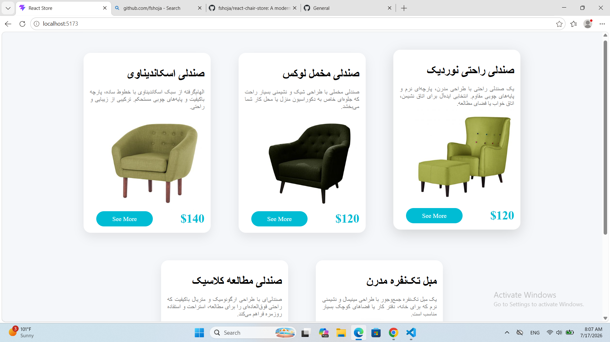

# 🪑 React Chair Store

A modern and responsive furniture store application built with **React**, **Vite**, and **React Router**. The project provides a clean shopping experience with product browsing, category filtering, and a responsive user interface.

## 🚀 GitHub Repository

👉 **[View the Project on GitHub](https://github.com/fshoja/react-chair-store)**


## 📸 Preview




## ✨ Features

- Responsive design
- Modern React components
- React Router navigation
- Product listing and categories
- Clean and reusable code structure
- Fast development with Vite

## 🛠️ Technologies

- React
- Vite
- React Router
- JavaScript (ES6+)
- CSS

## 📦 Installation

```bash
npm install
npm run dev
```